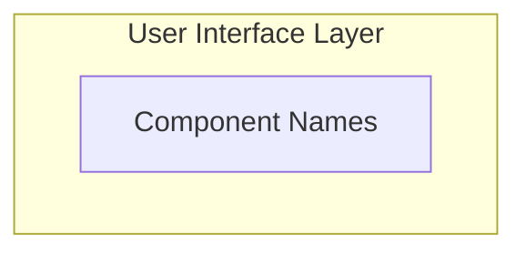

# DocGenAI

**AI-powered documentation generator that creates comprehensive technical documentation from your codebase using advanced language models.**

## Overview

DocGenAI is an intelligent documentation generation tool that analyzes your codebase and produces high-quality technical documentation. It uses smart file selection, token-aware chunking, and purpose-specific prompts to generate documentation that serves both systems engineers and developers.

**Key Features:**

- 🧠 **LLM-First Architecture**: Leverages advanced AI models for deep code understanding
- 📊 **Smart File Selection**: Automatically identifies the most important files using heuristics
- 🎯 **Comprehensive Analysis**: Generates architecture diagrams, data flow analysis, and component documentation
- 🚀 **Platform Optimized**: MLX for Apple Silicon, Transformers for Linux/Windows
- 📝 **Multiple Documentation Types**: Single-file analysis and multi-chunk synthesis for large codebases
- 💾 **Intelligent Caching**: Efficient caching system for models and generated documentation

## 🚀 Quick Start

### Installation

```bash
# Clone the repository
git clone <repository-url>
cd docgenai

# Install dependencies
poetry install

# Quick test
poetry run python -m src.docgenai.cli generate src/docgenai/config.py -o test_output
```

### Basic Usage

```bash
# Generate documentation for a single file
python -m src.docgenai.cli generate myfile.py -o output

# Analyze an entire codebase
python -m src.docgenai.cli generate /path/to/codebase -o documentation

# Generate with specific metadata mode
python -m src.docgenai.cli generate src/ -o docs --metadata-mode file
```

## 📖 Understanding DocGenAI Documentation Types

DocGenAI generates different types of documentation depending on your codebase size and complexity:

### Single-Chunk Documentation

**When it's used**: Small codebases or individual files that fit within the model's context window.

**Characteristics**:
- Direct analysis using comprehensive architecture prompts
- Includes Mermaid diagrams for system architecture and data flow
- Focused on the specific files being analyzed
- Typically starts with `## System Overview`

**Example output structure**:
```markdown
## System Overview
## System Architecture

## Data Flow Analysis
## Component Details
```

### Multi-Chunk Documentation (Unified Documentation)

**When it's used**: Large codebases that require multiple chunks to analyze completely.

**Characteristics**:
- Starts with `## UNIFIED DOCUMENTATION` header
- Synthesizes insights from multiple chunk analyses
- Provides a comprehensive view of the entire system
- Includes architecture diagrams based on synthesis of all chunks
- More comprehensive than single-chunk analysis

**Example output structure**:
```markdown
## UNIFIED DOCUMENTATION

## SYSTEM OVERVIEW
[Synthesized view of entire system]

## ARCHITECTURE & DESIGN
```mermaid
graph TD
    [Components from all chunks]
```
[Unified architectural analysis]

## DATA FLOW & PROCESSING
[System-wide data flow analysis]
```

**What "Unified" means**: The documentation synthesizes analysis from multiple code chunks into a single, coherent view of your entire system. Instead of separate analyses of different parts, you get one comprehensive document that explains how everything works together.

### Architecture Types

DocGenAI supports two architecture analysis types:

#### Standard Architecture
- Basic architectural analysis
- Component identification and relationships
- Suitable for most codebases

#### Comprehensive Architecture (Default)
- Detailed architectural analysis with Mermaid diagrams
- System architecture diagrams
- Data flow diagrams
- Component interaction analysis
- More detailed than standard analysis

## 🔧 Configuration

DocGenAI uses a `config.yaml` file for configuration:

```yaml
# Output Configuration
output:
  dir: "output"
  filename_template: "{name}_documentation.md"
  include_architecture: true
  include_code_stats: true
  markdown_style: "github"
  metadata_mode: "file"  # Options: "none", "footer", "file"
  architecture_type: "comprehensive"  # Options: "standard", "comprehensive"

# Model Configuration
model:
  # Platform-aware model selection
  mlx_model: "mlx-community/DeepSeek-Coder-V2-Lite-Instruct-4bit"
  transformers_model: "TechxGenus/DeepSeek-Coder-V2-Lite-Instruct-AWQ"
  temperature: 0.1
  max_tokens: 4000

# File Selection
file_selection:
  max_files: 50
  max_file_size: 10000
  include_patterns:
    - "*.py"
    - "*.js"
    - "*.ts"
    - "*.go"
    # ... more patterns

# Chunking Configuration
chunking:
  max_chunk_tokens: 12000
  overlap_tokens: 500
  prefer_file_boundaries: true
```

## 📊 Metadata Modes

DocGenAI supports three metadata modes to suit different workflows:

### `none` - Clean Documentation
```bash
python -m src.docgenai.cli generate src/ -o docs --metadata-mode none
```
Generates clean documentation without any metadata footer.

### `footer` - Inline Metadata (Default)
```bash
python -m src.docgenai.cli generate src/ -o docs --metadata-mode footer
```
Includes metadata as a footer section in the documentation file.

### `file` - Separate Metadata File
```bash
python -m src.docgenai.cli generate src/ -o docs --metadata-mode file
```
Saves metadata as a separate `.metadata.md` file alongside the documentation.

**Metadata includes**:
- Files analyzed and processing details
- Generation timestamp and model used
- File tree structure
- Chunking strategy and token limits
- Platform and backend information

## 🏗️ How DocGenAI Works

### 1. Smart File Selection
DocGenAI uses heuristics to identify the most important files in your codebase:

- **Entry Points**: `main.py`, `index.js`, `app.py`, `server.js`
- **Configuration Files**: `package.json`, `requirements.txt`, `Dockerfile`
- **API Files**: Routes, controllers, handlers, services
- **Core Logic**: Largest files, most imports/exports
- **Documentation**: Existing README and docs files

### 2. Intelligent Chunking
For large codebases, DocGenAI splits files into token-aware chunks:

- **Token Limits**: Respects model context limits (typically 12,000 tokens per chunk)
- **File Boundaries**: Prefers keeping related files together
- **Large File Handling**: Extracts signatures and key structures from very large files
- **Overlap**: Maintains context between chunks

### 3. Documentation Generation
Depending on the size of your codebase:

**Single Chunk**: Direct analysis with comprehensive architecture prompts
**Multiple Chunks**: Individual chunk analysis followed by synthesis

### 4. Post-Processing
- Cleans up formatting issues
- Applies templates if configured
- Generates metadata based on configuration

## 🎯 Supported Languages

DocGenAI supports analysis of multiple programming languages:

- **Python** (.py) - Full support with advanced analysis
- **JavaScript/TypeScript** (.js, .ts, .jsx, .tsx)
- **Go** (.go)
- **Java** (.java)
- **C/C++** (.c, .cpp, .h, .hpp)
- **Rust** (.rs)
- **Ruby** (.rb)
- **PHP** (.php)
- **C#** (.cs)
- **Swift** (.swift)
- **Kotlin** (.kt)

## 🚀 Platform Optimization

DocGenAI automatically detects your platform and uses optimal models:

### macOS (Apple Silicon)
- **Model**: `mlx-community/DeepSeek-Coder-V2-Lite-Instruct-4bit`
- **Backend**: MLX with native Apple Silicon optimization
- **Performance**: ~6s model loading, ~17s per file generation
- **Memory**: ~4-6GB RAM usage

### Linux/Windows
- **Model**: `TechxGenus/DeepSeek-Coder-V2-Lite-Instruct-AWQ`
- **Backend**: Transformers with optional CUDA acceleration
- **Performance**: ~60s model loading, ~30s per file generation
- **Memory**: ~6-16GB RAM usage

## 📝 Example Output

DocGenAI generates comprehensive documentation including:

### System Overview
- What the system does and why it exists
- Core problem solved and target users
- System type (web app, API, library, CLI tool, etc.)
- Key business capabilities

### Architecture & Design
- System architecture diagrams (Mermaid)
- Component relationships and interactions
- Architectural patterns and design decisions
- Technology stack overview

### Data Flow Analysis
- Data flow diagrams (Mermaid)
- Processing stages and transformations
- Storage and persistence patterns
- Integration points and APIs

### Component Details
- Purpose and responsibility of major components
- Key classes, functions, and interfaces
- Dependencies and configuration
- Integration points and error handling

### Developer Guidance
- Setup and development workflow
- Key patterns and conventions
- Extension points and best practices
- Testing strategies and debugging tips

## 🛠️ CLI Commands

### Core Commands

```bash
# Generate documentation
python -m src.docgenai.cli generate <path> [options]

# Available options:
-o, --output-dir TEXT     Output directory for generated docs
--metadata-mode TEXT      Metadata mode: none, footer, file
--offline                 Force offline mode (use cached models only)
--no-cache               Disable caching for this run
```

### Cache Management

```bash
# Clear all caches
python -m src.docgenai.cli cache --clear

# View cache information
python -m src.docgenai.cli cache --info
```

## 🔧 Development

### Project Structure

```text
docgenai/
├── src/docgenai/           # Main application code
│   ├── core.py            # Documentation generation pipeline
│   ├── models.py          # AI model abstractions
│   ├── file_selector.py   # Smart file selection
│   ├── chunker.py         # Token-aware chunking
│   ├── cli.py             # Command-line interface
│   ├── config.py          # Configuration management
│   ├── cache.py           # Caching system
│   ├── prompts/           # Purpose-specific prompts
│   │   ├── architecture.py    # Architecture analysis prompts
│   │   ├── synthesis.py       # Multi-chunk synthesis prompts
│   │   └── base_prompts.py    # Base formatting rules
│   └── templates/         # Documentation templates
├── docs/                  # Project documentation
├── tests/                 # Test suite
└── config.yaml           # Default configuration
```

### Development Setup

```bash
# Install development dependencies
poetry install

# Run tests
poetry run pytest

# Run linting
poetry run pre-commit run --all-files
```

## 🐛 Troubleshooting

### Common Issues

**Large codebase analysis is slow**:
- ✅ **Solution**: This is expected for large codebases. DocGenAI analyzes each chunk individually then synthesizes results.

**Mermaid diagrams have formatting issues**:
- ✅ **Solution**: DocGenAI includes post-processing to clean up common formatting issues automatically.

**Out of memory errors**:
- ✅ **Solution**: Reduce `max_files` in config or process smaller directories individually.

**Model download issues**:
- ✅ **Solution**: Check internet connection and available disk space. Models are 3-9GB depending on platform.

### Getting Help

```bash
# View system information
python -m src.docgenai.cli info

# Check cache status
python -m src.docgenai.cli cache --info

# Command help
python -m src.docgenai.cli --help
```

## 📄 License

See [LICENSE](LICENSE) file for details.

## 🤝 Contributing

1. Follow the coding standards in [docs/developer.md](docs/developer.md)
2. Add tests for new functionality
3. Update documentation for any changes
4. Run pre-commit hooks before committing
5. Use conventional commit messages

For detailed development information, see [docs/developer.md](docs/developer.md).
