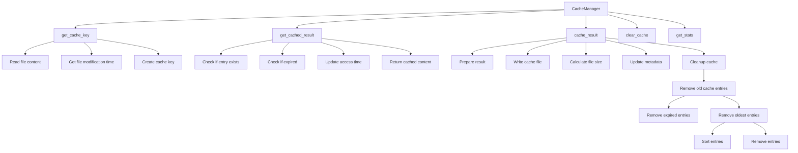

# Documentation: cache.py

## Documentation


## Overview

The `cache.py` module provides caching utilities for `DocGenAI` to improve performance by storing frequently used data, such as generation results and model instances, in memory or on disk to avoid expensive recomputation and reloading.

## Key Components

- **CacheManager**: A unified cache manager for `DocGenAI` that handles caching of generation results and model instances.

- **get_cache_key**: Generates a cache key from file content and options.

- **get_cached_result**: Retrieves a cached generation result.

- **cache_result**: Caches a generation result.

- **clear_cache**: Clears all cache entries.

- **get_stats**: Gets cache statistics.

- **GenerationCache**: Backward compatibility wrapper for `CacheManager`.

- **ModelCache**: Handles session-level model caching.

## Architecture

The `CacheManager` class uses a directory to store cached entries. Each entry is identified by a unique cache key, which is generated from the file content and options. The cache manager maintains metadata about each entry, including its creation time, last access time, and size. The cache manager also periodically cleans up old entries to avoid consuming too much disk space.

## Usage Examples

### Caching a Generation Result

```python
from src.docgenai.cache import CacheManager

# Initialize CacheManager with configuration

config = {
    "enabled": True,
    "directory": ".docgenai_cache",
    "max_size_mb": 1000,
    "ttl_hours": 24,
}
cache_manager = CacheManager(config)

# Generate a cache key from file content and options

cache_key = cache_manager.get_cache_key("path/to/source/file.py")

# Cache a generation result

result = {
    "input_file": "path/to/source/file.py",
    "output_file": "path/to/output/file.py",
    "documentation": "Generated documentation",
    "generation_time": time.time(),
}
cache_manager.cache_result(cache_key, result)

### Retrieving a Cached Generation Result

```python

# Retrieve a cached generation result

cached_result = cache_manager.get_cached_result(cache_key)
if cached_result:
    print(cached_result["documentation"])

## Dependencies

- `hashlib`

- `json`

- `time`

- `pathlib`

- `typing`

## Configuration

- `enabled`: Whether caching is enabled (default: `True`).

- `directory`: Directory where cached entries are stored (default: `.docgenai_cache`).

- `max_size_mb`: Maximum cache size in megabytes (default: `1000`).

- `ttl_hours`: Time-to-live for cached entries in hours (default: `24`).

## Error Handling

- The `get_cache_key` and `get_cached_result` methods handle file reading and JSON decoding errors by returning a unique key for errors.

- The `cache_result` method handles file writing and JSON encoding errors by failing silently.

## Performance Considerations

- The cache manager periodically cleans up old entries to avoid consuming too much disk space.

- The `get_cached_result` method checks if an entry is expired before returning it.

- The `cache_result` method calculates the file size and updates the metadata after caching a new entry.

## Architecture Analysis

```mermaid
flowchart TD
    A[Start] --> B[Initialize CacheManager]
    B --> C[Config Enabled]
    C -->|Yes| D[Create Cache Directory]
    D --> E[Load Metadata]
    E -->|No| F[Initialize Metadata]
    F --> G[Initialize Cache Manager]
    G --> H[Get Cache Key]
    H --> I[Read File Content]
    I --> J[Generate Content Hash]
    J --> K[Generate Cache Key]
    K --> L[Cache Result]
    L --> M[Update Metadata]
    M --> N[Save Metadata]
    N --> O[Cache Result]
    O --> P[Check Cache Size]
    P -->|Exceeds| Q[Cleanup Cache]
    Q --> R[Remove Expired Entries]
    R --> S[Remove Oldest Entries]
    S --> T[Save Metadata]
    T --> U[Cache Result]
    U --> V[End]

```mermaid
flowchart TD
    A[Start] --> B[Initialize CacheManager]
    B --> C[Config Enabled]
    C -->|Yes| D[Create Cache Directory]
    D --> E[Load Metadata]
    E -->|No| F[Initialize Metadata]
    F --> G[Initialize Cache Manager]
    G --> H[Get Cache Key]
    H --> I[Read File Content]
    I --> J[Generate Content Hash]
    J --> K[Generate Cache Key]
    K --> L[Cache Result]
    L --> M[Update Metadata]
    M --> N[Save Metadata]
    N --> O[Cache Result]
    O --> P[Check Cache Size]
    P -->|Exceeds| Q[Cleanup Cache]
    Q --> R[Remove Expired Entries]
    R --> S[Remove Oldest Entries]
    S --> T[Save Metadata]
    T --> U[Cache Result]
    U --> V[End]

```mermaid
flowchart TD
    A[Start] --> B[Initialize CacheManager]
    B --> C[Config Enabled]
    C -->|Yes| D[Create Cache Directory]
    D --> E[Load Metadata]
    E -->|No| F[Initialize Metadata]
    F --> G[Initialize Cache Manager]
    G --> H[Get Cache Key]
    H --> I[Read File Content]
    I --> J[Generate Content Hash]
    J --> K[Generate Cache Key]
    K --> L[Cache Result]
    L --> M[Update Metadata]
    M --> N[Save Metadata]
    N --> O[Cache Result]
    O --> P[Check Cache Size]
    P -->|Exceeds| Q[Cleanup Cache]
    Q --> R[Remove Expired Entries]
    R --> S[Remove Oldest Entries]
    S --> T[Save Metadata]
    T --> U[Cache Result]
    U --> V[End]

---

*Generated by DocGenAI using mlx backend*
```
