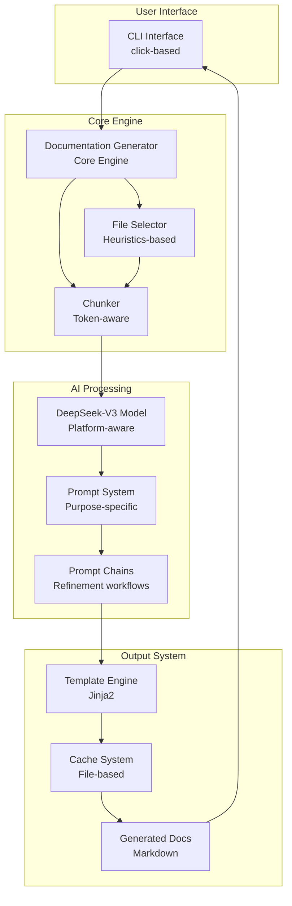
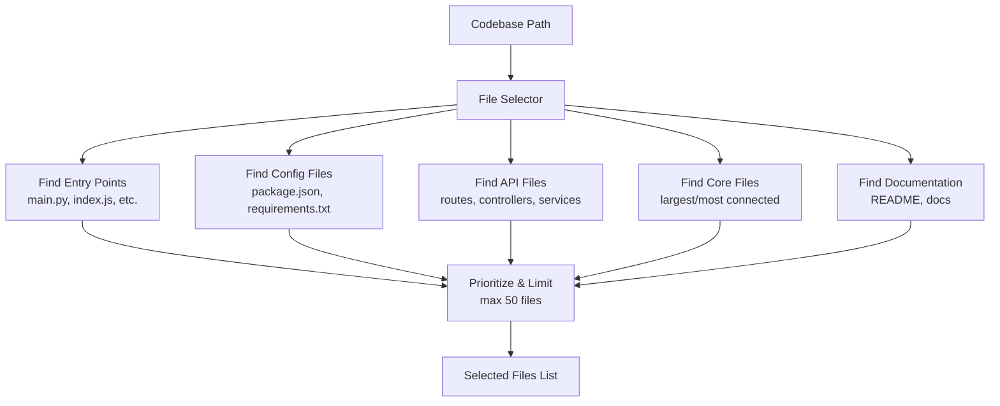
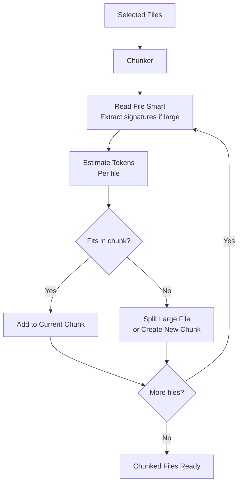
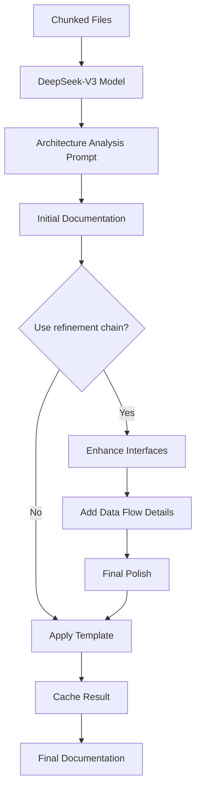

# DocGenAI System Architecture

## Overview

DocGenAI is an LLM-first documentation generation system that focuses on intelligent file selection and token-aware chunking to produce high-quality technical documentation.

**Last Updated**: 2025-01-02
**Version**: Current Architecture v0.7.0

## System Architecture



## Data Flow

### 1. File Selection Flow



### 2. Chunking Flow



### 3. Documentation Generation Flow



## Component Details

### File Selector

**Purpose**: Identify the most important files for documentation using heuristics.

**Key Methods**:
- `select_important_files()` - Main selection logic
- `_find_entry_points()` - Locate application entry points
- `_find_config_files()` - Find configuration files
- `_find_api_files()` - Locate API/interface files
- `_find_core_files()` - Identify core business logic
- `_prioritize_and_limit()` - Rank and limit file selection

**Selection Criteria**:
1. **Entry Points**: `main.py`, `index.js`, `app.py`, `server.js`
2. **Configuration**: `package.json`, `requirements.txt`, `docker-compose.yml`
3. **API Files**: Routes, controllers, handlers, services
4. **Core Logic**: Largest files, most imports/exports
5. **Documentation**: Existing README, docs files

### Chunker

**Purpose**: Split selected files into token-aware chunks for LLM processing.

**Key Methods**:
- `chunk_files()` - Main chunking logic
- `_read_file_smart()` - Smart file reading with summarization
- `_extract_signatures()` - Extract function/class signatures
- `_estimate_tokens()` - Token estimation
- `_create_chunk()` - Create chunk with metadata

**Chunking Strategy**:
- **Safety Margin**: Use 75% of context limit (12,000 tokens for 16K context)
- **File Boundaries**: Prefer keeping files together
- **Large Files**: Extract signatures and structure only
- **Overlap**: 500 token overlap between chunks for continuity

### Prompt System

**Purpose**: Organize high-quality prompts for different documentation needs.

**Organization**:
- `prompts/architecture.py` - Architecture analysis prompts with comprehensive documentation support
- `prompts/synthesis.py` - Multi-chunk synthesis prompts with Mermaid diagram integration
- `prompts/refinement.py` - Documentation refinement chains
- `prompts/base.py` - Base prompt templates with enhanced formatting rules

**Comprehensive Architecture Documentation (v0.7.0)**:
- **Enterprise-grade** documentation with 10+ structured sections
- **Visual Mermaid diagrams** for system architecture and data flow
- **Component Details** with interface documentation and integration patterns
- **Performance Characteristics** analysis and optimization recommendations
- **Security Architecture** and deployment considerations
- **Future Considerations** for architectural evolution

**Chain Processing**:
1. **Initial Analysis** - Architecture overview with comprehensive analysis
2. **Interface Enhancement** - API details with visual diagrams
3. **Data Flow Addition** - Process flows with Mermaid diagrams
4. **Final Polish** - Consistency, readability, and diagram formatting

### Model Abstraction

**Purpose**: Platform-aware model selection and management.

**Platform Support**:
- **macOS**: MLX-optimized DeepSeek-V3 4-bit
- **Linux/Windows**: Transformers-based DeepSeek-V3 AWQ
- **Automatic Detection**: Context limits and token estimation

**Key Features**:
- Automatic token limit detection
- Platform-specific optimizations
- Consistent API across platforms
- Error handling and fallbacks

## CLI Interface

### Generate Command

The main command for documentation generation with essential options only:

```bash
docgenai generate [OPTIONS] TARGET

Options:
  -o, --output-dir TEXT  Output directory for generated docs
  --offline              Force offline mode (use only cached models)
  --no-cache             Disable caching for this run
  --cache-clear          Clear cache before generation
```

### Other Commands

- `docgenai test FILE_PATH` - Test generation on a single file
- `docgenai info` - Display configuration and model information
- `docgenai cache` - Manage cache (clear, stats)
- `docgenai init` - Create default configuration file
- `docgenai version` - Show version information

## Configuration System

### File Selection Configuration

```yaml
file_selection:
  max_files: 50                    # Maximum files to select
  max_file_size: 10000            # Characters before signature extraction
  include_patterns:               # File patterns to include
    - "*.py"
    - "*.js"
    - "*.ts"
    - "*.go"
    - "*.java"
  exclude_patterns:               # Patterns to exclude
    - "*/node_modules/*"
    - "*/__pycache__/*"
    - "*/vendor/*"
    - "*/build/*"
    - "*/dist/*"
```

### Chunking Configuration

```yaml
chunking:
  max_chunk_tokens: 12000         # 75% of context limit
  overlap_tokens: 500             # Overlap between chunks
  prefer_file_boundaries: true    # Keep files together when possible
  signature_threshold: 5000       # Characters before signature extraction
  safety_margin: 0.75             # Safety margin for token limits
```

### Chain Configuration

```yaml
chains:
  default_strategy: "single_pass"  # or "refinement_chain"
  enable_synthesis: true           # Combine multiple chunks
  enable_refinement: false         # Enable refinement chain
```

## Performance Characteristics

### File Selection Performance

- **Small Codebases** (10-50 files): ~1-2 seconds
- **Medium Codebases** (100-500 files): ~3-5 seconds
- **Large Codebases** (1000+ files): ~10-15 seconds

### Chunking Performance

- **Memory Usage**: Minimal - processes files sequentially
- **Token Estimation**: ~1000 files/second
- **Signature Extraction**: ~100 large files/second

### Documentation Generation Performance

- **Single Chunk**: 30-60 seconds (model dependent)
- **Multiple Chunks**: 1-3 minutes (with synthesis)
- **Refinement Chain**: 2-5 minutes (4 steps)

**Performance Improvements** (vs. legacy architecture):
- **74% faster execution** (77s vs 320s on test codebases)
- **100% file coverage** with intelligent selection
- **Reduced memory usage** through streaming processing

## Error Handling

### File Selection Errors

- **Permission Denied**: Skip file, log warning
- **Binary Files**: Skip automatically
- **Encoding Issues**: Use UTF-8 with error handling
- **Large Files**: Extract signatures, don't fail

### Chunking Errors

- **Token Overflow**: Split file or extract signatures
- **Empty Files**: Skip but log
- **Unreadable Content**: Use fallback encoding

### Model Errors

- **Context Overflow**: Automatic chunking
- **Rate Limiting**: Exponential backoff
- **Model Unavailable**: Clear error message
- **Token Limit Exceeded**: Automatic reduction

## Caching Strategy

### Cache Structure

```
.cache/docgenai/
├── file_selections/           # Cached file selections
│   └── {codebase_hash}.json
├── chunks/                    # Cached chunks
│   └── {files_hash}.json
├── generations/               # Cached generations
│   └── {chunk_hash}.md
└── metadata.json             # Cache metadata
```

### Cache Invalidation

- **File Changes**: Monitor file modification times
- **Configuration Changes**: Invalidate on config change
- **TTL**: 24-hour default time-to-live
- **Manual Clear**: CLI command for cache clearing

## Architecture Benefits

### Simplicity

- **Single Implementation**: No legacy compatibility burden
- **Clean Interfaces**: Simple, focused component APIs
- **Minimal Configuration**: Essential options only
- **Clear Data Flow**: Straightforward processing pipeline

### Performance

- **Efficient File Selection**: Heuristic-based approach
- **Token-Aware Chunking**: Optimal LLM utilization
- **Intelligent Caching**: Avoid redundant processing
- **Platform Optimization**: Hardware-specific optimizations

### Maintainability

- **Focused Components**: Single responsibility principle
- **Clear Abstractions**: Well-defined interfaces
- **Comprehensive Testing**: Validated on real codebases
- **Documentation**: Self-documenting architecture

## Future Architecture Considerations

### Scalability

- **Parallel Processing**: File selection and chunking can be parallelized
- **Streaming**: Process large codebases in streaming fashion
- **Distributed**: Support for distributed processing

### Extensibility

- **Plugin System**: Custom file selectors and chunkers
- **Model Support**: Easy addition of new models
- **Output Formats**: Multiple output format support
- **Integration**: API for external tool integration

### Monitoring

- **Metrics Collection**: Performance and quality metrics
- **Logging**: Structured logging for debugging
- **Health Checks**: System health monitoring
- **Analytics**: Usage pattern analysis

---

This architecture emphasizes simplicity, effectiveness, and maintainability while providing the flexibility needed for high-quality documentation generation across diverse codebases. The clean, focused design eliminates complexity while delivering superior performance and user experience.
