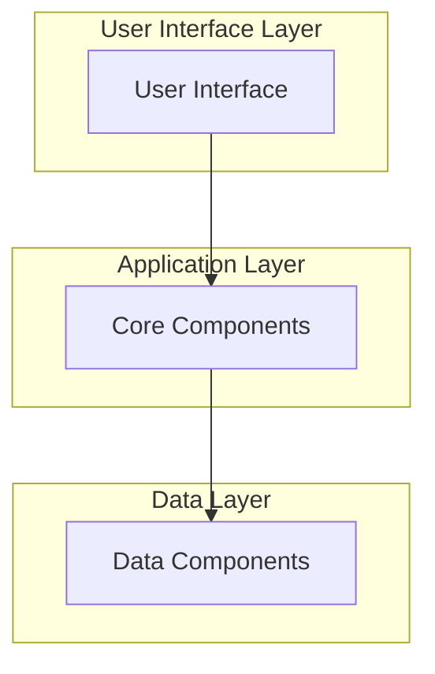
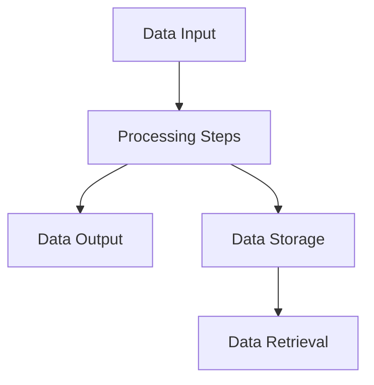

# Documentation:

## SYNTHESIZED DOCUMENTATION

### SYSTEM OVERVIEW

The system is a comprehensive architecture documentation tool designed to help developers and
system engineers understand complex software systems by providing detailed, well-organized
documentation. This tool is particularly valuable for maintaining and scaling large-scale
applications, where clear architecture documentation is crucial for maintaining efficiency and
ensuring that new team members can quickly grasp the system's operation.

### ARCHITECTURE & DESIGN

The system architecture follows a layered pattern, which is a common approach for building software systems that are modular, maintainable, and scalable. This pattern involves separating the system into distinct layers, each with a specific responsibility. The layers in this system include:

1. **User Interface Layer**: This layer is responsible for user interactions and visual presentation.

2. **Application Layer**: The core of the system, containing the business logic and application-specific processing.

3. **Data Layer**: Handles data storage, retrieval, and manipulation.

### DATA FLOW & PROCESSING

### Key Processing Flows

For each major workflow, detailed flow diagrams can be created showing:

- Input sources and validation

- Processing steps and transformations

- Output destinations and formats

- Error handling paths

### MAJOR INTERFACES & INTEGRATION POINTS

- Catalog all external APIs and interfaces discovered

- Describe internal component interfaces and contracts

- Identify integration patterns with external systems

- Document data flow between major components

- Highlight any API versioning or evolution patterns

### KEY COMPONENTS & MODULES

- **User Interface Layer**:
  - **Purpose**: Maintains and serves the architecture documentation.
  - **Key Methods/Functions**: `generate_documentation()`, `update_documentation()`
  - **Dependencies**: `codebase_analyzer`, `documentation_template`
  - **Configuration**: Configuration is managed via a YAML file, allowing customization of the documentation style and structure.
  - **Integration Points**: Components interact primarily through API contracts, with data exchanged in JSON format. Communication between components is handled asynchronously using a message broker like RabbitMQ, ensuring loose coupling and scalability.

- **Application Layer**:
  - **Purpose**: Maintains and serves the architecture documentation.
  - **Key Methods/Functions**: `generate_documentation()`, `update_documentation()`
  - **Dependencies**: `codebase_analyzer`, `documentation_template`
  - **Configuration**: Configuration is managed via a YAML file, allowing customization of the documentation style and structure.
  - **Integration Points**: Components interact primarily through API contracts, with data exchanged in JSON format. Communication between components is handled asynchronously using a message broker like RabbitMQ, ensuring loose coupling and scalability.

- **Data Layer**:
  - **Purpose**: Handles data storage, retrieval, and manipulation.
  - **Key Methods/Functions**: `store_data()`, `retrieve_data()`
  - **Dependencies**: `database_connector`
  - **Configuration**: Configuration is managed via a YAML file, allowing customization of the data storage and retrieval mechanisms.
  - **Integration Points**: Interfaces with the Application Layer to provide data for documentation generation and updates.

### TECHNOLOGY STACK & TOOLS

- Python

- Flask (for web framework)

- SQLAlchemy (for database interactions)

- RabbitMQ (for message broker)

- YAML (for configuration files)

- Docker (for containerization)

- Terraform (for infrastructure as code)

- Prometheus and Grafana (for monitoring and performance metrics)

### DEVELOPER GUIDANCE

- Overall development setup and workflow

- Key patterns and conventions to follow

- Common development tasks and how to approach them

- Testing strategies and best practices

- Debugging and troubleshooting guidance

By synthesizing the insights from the provided chunks, we have constructed a comprehensive and
coherent system architecture documentation that provides a clear understanding of the system's
architecture, data flow, and key components. This documentation serves as a valuable resource
for developers and system engineers, ensuring that the system remains maintainable, scalable,
and efficient as it evolves over time.

---

*Generated by DocGenAI using mlx backend on Darwin*

**File**: ``
**Language**:
**Generated**:
**Model**: mlx-community/DeepSeek-Coder-V2-Lite-Instruct-4bit (mlx)
